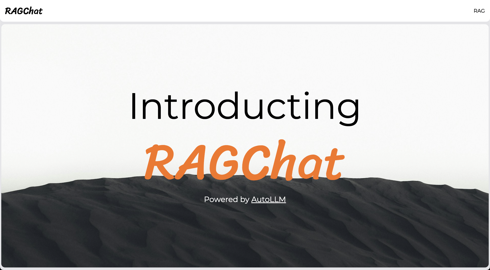

# RAGChat

RAG stands for Retrieval-Augmented Generation. Here's a breakdown of what it is and how it works:



---

## What is RAG

RAG is a technique used to improve the responses of large language models (LLMs) like GPT-3 and others. It combines the following:

-   **Generative Language Models**: These models are fantastic at producing human-quality text, understanding context, and engaging in conversations. However, they can make things up (hallucinate) or rely on outdated information from their training data.
-   **Retrieval Systems**: These systems can search large databases of text or knowledge bases to find relevant information based on a user's query.

RAG bridges the gap by having the retrieval system find relevant information, which is then provided to the language model along with the original query. This helps the language model generate even better responses.

---

## How Does RAG Work?

-   **User Query**: A user asks a question or gives a prompt.
-   **Retrieval**: The retrieval system searches a knowledge base (like Wikipedia or a company's internal documents) to locate the most relevant pieces of information.
-   **Generation**: The language model takes both the original query and the retrieved information as input. It then processes this combined input to create a more informed and accurate response.

---

## Why use RAG in the first place

-   **Improved Accuracy**: Access to relevant knowledge helps the language model avoid making incorrect statements or relying on outdated information.
-   **Verifiable Answers**: RAG can often provide references or citations to support the generated response, allowing users to fact-check the information.
-   **Handling "I don't know" Situations**: A RAG model is better at recognizing when the knowledge base doesn't contain a good answer to the question, leading it to respond honestly rather than making something up.
-   **Up-To-Date Information**: Since it pulls from a knowledge base, a RAG model can access the latest information even if its knowledge from training is old.

---

## How do I use this app

### Starting the backend:

-   Install a python environment manager like [Miniconda](https://docs.anaconda.com/free/miniconda/#quick-command-line-install) by following the steps given in the link.
-   Get an OpenAI API key. Will be given with the project itself.
-   Verify that the key is in the `.env` file in the `backend` folder.
-   It should look something like:

```bash
OPENAI_API_KEY=sk-...
```

-   Go to the cackend folder in your terminal.

```bash
cd backend
```

-   Create a new python environment.

```bash
conda create -n rag -y python=3.10
```

-   Activate the new environment.

```bash
conda activate rag
```

-   Install all the dependencies.

```bash
python -m pip install -r requirements.txt
```

-   Start the backend server.

```bash
python app.py
```

### Starting the frontend:

-   Ensure `node >= 18` and npm is installed in your system.
-   If not, we recommend that instead of installing them directly install a [`nvm`](https://github.com/nvm-sh/nvm) for Linux and MacOS based systems and [`nvm-windows`](https://github.com/coreybutler/nvm-windows) for Windows.
-   Follow the installation guides provided in the links.
-   Install node and npm in your system by using the following commands.

```bash
nvm install 21
nvm use 21
```

-   No go to the frontend folder in the terminal.

```bash
cd frontend
```

-   Install the dependencies.

```bash
npm install
```

-   Now run the frontend.

```bash
npm run dev
```

-   Now go to [`http://localhost:3000`](http://localhost:3000) on your browser.
-   You will now be able to use RAG.

### Using the app

The following video demo will show how to use RAGChat.

https://github.com/bytes2pro/rag-foss/assets/44979866/4fdc4de8-d87f-4f21-8c15-78798c2c3279

---

## How is RAG implemented here

-   On the server side we use [`AutoLLM`](https://github.com/safevideo/autollm) for generating the embeddings and OpenAI for querying.
-   Various FOSS tools provided by `Langchain` and.`Llama-Index` are used for reading and tokenizing the uploaded documents.
-   These tools are implemented within `AutoLLM`.
-   These documents are then passed on to rthe embedding model.
-   We use the `text-embedding-ada-002` model provided by OpenAI to generate the embeddings.
-   The generated embeddings are stored locally in a [`LanceDB`](https://lancedb.com/) vector database.
-   The querying model used in `GPT-3.5-Turbo` provided by OpenAI.
-   When the model is queried, the query is converted to embeddings and the embeddings are then compared to the ones stored in our vector database.
-   If similar embeddings ar efound, they are passed onto the model along with our original query.
-   The model uses this data to generate a response.
